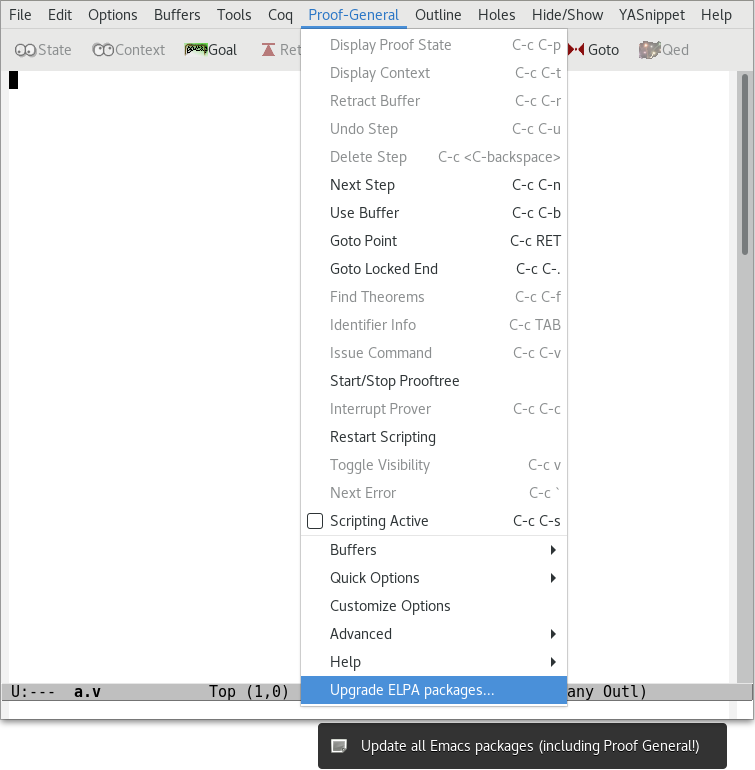

## What is Proof General?

**Proof General** is a generic interface for *proof assistants* (also
known as *interactive theorem provers*), based on the extensible,
customizable text editor [Emacs](https://www.gnu.org/software/emacs/).

Proof General has been developed at the
[LFCS](http://wcms.inf.ed.ac.uk/lfcs/) in the
[University of Edinburgh](http://www.ed.ac.uk/), mainly by
[David Aspinall](http://homepages.inf.ed.ac.uk/da), with contributions
from other sites.  It is distributed under the conditions of the
[GNU General Public License v3.0 or later](https://www.gnu.org/licenses/gpl-3.0.html).

The authors of Proof General are listed in the [AUTHORS](/AUTHORS) file.
Many more people have also contributed.  Please see the CREDITS
section in the manual for a more complete list of contributors.


Proof General offers a full support for latest versions of the Coq proof assistant:

- [](https://coq.inria.fr/)
  **Coq Proof General**,
  for [Coq](https://coq.inria.fr/)  
  by Healfdene Goguen, Patrick Loiseleur, David Aspinall, and [Pierre Courtieu](http://cedric.cnam.fr/~courtiep/).

Proof General also supports previous versions of the following other proof assistants:

- [](http://www.cl.cam.ac.uk/research/hvg/Isabelle/)
  **Isabelle Proof General**,
  for [Isabelle](http://www.cl.cam.ac.uk/research/hvg/Isabelle/) (up to Isabelle2014)  
  by [David Aspinall](http://homepages.inf.ed.ac.uk/da) and [Makarius](http://sketis.net/).
- [](http://www.lama.univ-savoie.fr/~RAFFALLI/phox.html)
  **PhoX Proof General**,
  for [PhoX](http://www.lama.univ-savoie.fr/~RAFFALLI/phox.html)  
  by [Christophe Raffalli](http://www.lama.univ-savoie.fr/~RAFFALLI), Paul Roziere and Jean-Roch Sotty.
- **LEGO Proof General**,
  for [LEGO](http://www.dcs.ed.ac.uk/home/lego)
- **HOL Proof General**,
  for [HOL98/HOL4](https://hol-theorem-prover.org/)
- **ACL2 Proof General**,
  for [ACL2](http://www.cs.utexas.edu/users/moore/acl2)

These instances may be incomplete or not work with the latest theorem
prover versions.

Proof General is ready to be customized to new proof assistants. It can
be [very easy](https://github.com/ProofGeneral/PG/blob/master/obsolete/demoisa/demoisa-easy.el)
to get basic support working. Full [documentation on
configuration](https://github.com/ProofGeneral/PG/releases/download/v4.4/PG-adapting.pdf)
is provided. We welcome offers to support, extend and improve Proof
General instances. Please get in touch if you plan major work.

If you are considering supporting (or implementing) a new prover, please
read about the [Proof General Kit](http://proofgeneral.inf.ed.ac.uk/kit) architecture.
The idea is that proof assistants should support PGIP, a uniform protocol for
interaction, rather than use system-specific customization inside
interfaces. The main research prototype using PGIP is an experimental
[Eclipse](http://www.eclipse.org) plugin, although Emacs Proof General
supports some PGIP configuration.

## About Proof General branches

Two editions of Proof General are currently available:

* the (legacy) REPL-based, stable version of Proof General,
  gathered in the
  [master](https://github.com/ProofGeneral/PG/tree/master) branch, and
  licensed under GPLv3+;
* the (newest) Coq-specific, experimental version of Proof General,
  supporting asynchronous proof processing,
  gathered in the
  [async](https://github.com/ProofGeneral/PG/tree/async) branch, also
  licensed under GPLv3+.



## Quick installation instructions

The `master` version of Proof General is available on
[MELPA](https://melpa.org/), a repository of Emacs packages.
Skip this step if you already use MELPA. Otherwise, add the following
to your `.emacs` and restart Emacs:

```elisp
(require 'package)
;; (setq gnutls-algorithm-priority "NORMAL:-VERS-TLS1.3") ; see remark below
(add-to-list 'package-archives '("melpa" . "https://melpa.org/packages/") t)
(package-initialize)
```

> **Remark:** If you have Emacs 26.1 (which is precisely
> [the packaged version in Debian 10](https://packages.debian.org/emacs)),
> you may get the error message `Failed to download 'melpa' archive`
> during the package refresh step. This is a known bug
> ([debbug #34341](https://debbugs.gnu.org/cgi/bugreport.cgi?bug=34341))
> which has been fixed in Emacs 26.3 and 27.1, while a simple workaround
> consists in uncommenting the line
> `(setq gnutls-algorithm-priority "NORMAL:-VERS-TLS1.3")` above in your
> `.emacs`.

> **Note:** If you switch to MELPA from a previously manually-installed
> Proof General, make sure you removed the old versions of Proof General
> from your Emacs context (by removing from your `.emacs` the line
> loading `PG/generic/proof-site`, or by uninstalling the proofgeneral
> package provided by your OS package manager).

Then, run `M-x package-refresh-contents RET` followed by
`M-x package-install RET proof-general RET` to install and
byte-compile `proof-general`.

You can now open a Coq file (`.v`), an EasyCrypt file (`.ec`),
a qrhl-tool file (`.qrhl`), or a PhoX file (`.phx`)
to automatically load the corresponding major mode.

## Keeping Proof General up-to-date

As explained in the [MELPA documentation](https://melpa.org/#/getting-started), updating all MELPA packages in one go is as easy as typing
`M-x package-list-packages RET` then `r` (**r**efresh the package list), `U`(mark **U**pgradable packages), and `x` (e**x**ecute the installs and deletions).

Alternatively, you can use one of the following shortcuts:

* `M-x proof-upgrade-elpa-packages RET` or `M-x p-u-e-p RET`;
* the menu item `Proof-General -> Upgrade ELPA packages...` (screenshot below)

<a href="img/proof-upgrade-elpa-packages.png"></a>


TODO: Add a link to the doc


## Documentation

For more information about Proof General, see the
[README](https://github.com/ProofGeneral/PG#readme) file on the GitHub
repo, or browse the
[documentation](https://proofgeneral.github.io/doc) page.
